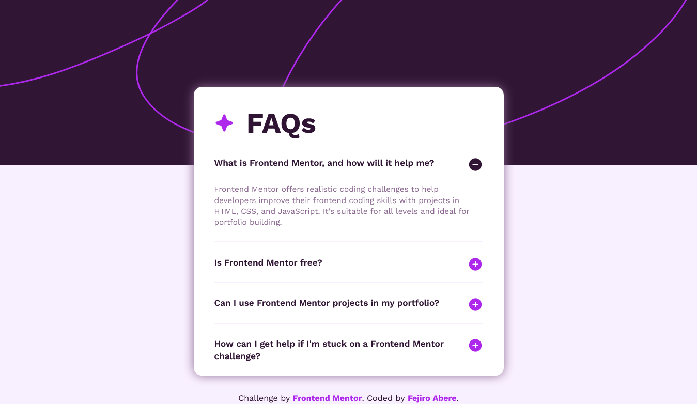

# Frontend Mentor - FAQ accordion solution

This is a solution to the [FAQ accordion challenge on Frontend Mentor](https://www.frontendmentor.io/challenges/faq-accordion-wyfFdeBwBz). Frontend Mentor challenges help you improve your coding skills by building realistic projects.

## Table of contents

- [Overview](#overview)
  - [The challenge](#the-challenge)
  - [Screenshot](#screenshot)
  - [Links](#links)
- [My process](#my-process)
  - [Built with](#built-with)
  - [What I learned](#what-i-learned)
  - [Continued development](#continued-development)
  - [Useful resources](#useful-resources)
- [Author](#author)

## Overview

### The challenge

Users should be able to:

- Hide/Show the answer to a question when the question is clicked
- Navigate the questions and hide/show answers using keyboard navigation alone
- View the optimal layout for the interface depending on their device's screen size
- See hover and focus states for all interactive elements on the page

### Screenshot



### Links

- Solution URL: [Solution URL](https://www.frontendmentor.io/solutions/responsive-faq-accordion-fvlP-h0S7M)
- Live Site URL: [Live site URL](https://fejiro001.github.io/faq-accordion-main/)

## My process

### Built with

- Semantic HTML5 markup
- CSS custom properties
- Mobile-first workflow
- ESLint

### What I learned

Learnt how I can program one detail to be open at a time by removing the open
attribute from previously clicked detail.

```js
let allSummary = document.querySelectorAll("summary");

allSummary.forEach((summary) => {
  summary.addEventListener("click", closeOpenedDetails);
});

function closeOpenedDetails() {
  allSummary.forEach((summary) => {
    let detail = summary.parentNode;

    if (detail != this) {
      detail.removeAttribute("open");
    }
  });
}
```

### Continued development

Learn more about accessibility.

### Useful resources

- [Accordions | Accessible Technology | Michigan Tech](https://www.mtu.edu/accessibility/training/web/accordions/#:~:text=Screen%20Reader%20Accessibility&text=Each%20accordion%20must%20start%20with%20an%20accurate%20aria%2Dexpanded%20attribute.&text=Use%20aria%2Dexpanded%3D%22false,your%20CMS%20or%20by%20hand.) - This helped implement an accessible accordion for screen readers and keyboard users.
- [Details and summary](https://web.dev/learn/html/details) - This helped me put the javascript logic for the accordion.

## Author

- Frontend Mentor - [@Fejiro001](https://www.frontendmentor.io/profile/Fejiro001)
- Twitter - [@aberefejiro](https://www.twitter.com/aberefejiro)
